# Shop game online

Đây là dự án website bán tài khoản Liên Quân mình xây dựng theo mô hình
full-stack. Mục tiêu của dự án là làm được một quy trình tương đối đầy đủ: khách
xem acc, nạp tiền, mua hàng và nhận thông tin tài khoản; CTV đăng sản phẩm; admin
quản lý toàn bộ dữ liệu trong hệ thống.

> Cần sử dụng dự án, vui lòng liên hệ Telegram: `@hieutran18204`.

## Công nghệ sử dụng

- Frontend: React 19, React Router, Vite, Axios và Lucide Icons.
- Backend: Node.js, Express 5, Sequelize và MariaDB/MySQL.
- Xác thực: JWT access token, refresh token, bcrypt và Cloudflare Turnstile.
- Thanh toán: SePay webhook và đối soát nội dung chuyển khoản.
- Chatbot: Gemini hoặc ViLao, có harness và tool truy vấn database.
- CI/CD và vận hành: GitHub Actions, Nginx, Cloudflare, PM2 và migration tự động.

## Hướng thiết kế giao diện

Dự án được làm theo hướng mobile-first vì phần lớn khách hàng truy cập shop bằng
điện thoại. Các thao tác chính như xem kho acc, xem giá, nạp tiền, mua hàng, xem
đơn và chat với trợ lý đều được ưu tiên để dùng thuận tiện trên màn hình nhỏ.

Giao diện vẫn responsive trên tablet, laptop và desktop. Cùng một chức năng sẽ
tự đổi cách sắp xếp card, menu, bảng dữ liệu và khoảng cách để không bị tràn màn
hình hoặc khó thao tác ở các kích thước khác nhau.

## Chức năng chính

### Khách hàng

- Xem trang chủ, danh mục game, loại tài khoản và số lượng acc đang bán.
- Lọc, sắp xếp và xem chi tiết từng tài khoản bằng mã sản phẩm.
- Hiển thị giá gốc, giá sale, mô tả, ảnh và chính sách bảo hành.
- Đăng ký, đăng nhập, refresh phiên đăng nhập và đăng xuất.
- Quản lý hồ sơ cá nhân, số dư và đổi mật khẩu.
- Nạp tiền tự động bằng mã giao dịch riêng. Hệ thống nhận webhook SePay, kiểm tra
  số tiền và cộng số dư sau khi giao dịch hợp lệ.
- Áp dụng mã giảm giá và mua acc bằng số dư trong ví.
- Quá trình mua dùng transaction và idempotency để hạn chế trừ tiền hoặc tạo đơn
  trùng khi người dùng bấm nhiều lần.
- Xem lịch sử đơn đã mua. Thông tin đăng nhập của acc chỉ xuất hiện trong đơn của
  đúng người đã mua.
- Giao diện responsive cho desktop và mobile, có dark mode và loading state riêng.

### Chatbot tư vấn

- Chat tự nhiên về sản phẩm, giá, đơn hàng, nạp tiền, bảo hành và liên hệ shop.
- Harness phân loại yêu cầu rồi mới cho model gọi tool phù hợp.
- Kết quả tư vấn acc được lấy trực tiếp từ database, bot không tự tạo giá hay sản phẩm.
- Tìm acc theo ngân sách, acc sale và loại tài khoản như Túi Mù.
- Nhớ ngữ cảnh tìm kiếm gần nhất. Ví dụ khách hỏi acc 600k rồi nhắn “1 nick thôi”
  thì hệ thống giữ mức giá cũ và trả đúng một card.
- Lưu lịch sử theo thread riêng và giới hạn số tin nhắn gửi tới model.
- Chặn prompt injection, câu hỏi quá ngoài phạm vi và nội dung có dấu hiệu làm lộ
  mật khẩu, OTP, token, cookie hoặc credential.
- Output từ model được validate lại trước khi trả về frontend.
- Có thể cấu hình model chính và tối đa 5 model fallback theo thứ tự ưu tiên.
- Admin có thể kiểm tra kết nối model nhưng API key luôn được mã hóa và không trả
  ngược lại trình duyệt.

### Cộng tác viên

- Dashboard theo dõi số acc, đơn hàng và doanh thu liên quan.
- Đăng tài khoản mới, tải ảnh hoặc nhập ảnh từ URL.
- Xem danh sách tài khoản và đơn hàng thuộc phạm vi CTV.
- Hệ thống tính hoa hồng theo mức admin cấu hình.

### Quản trị viên

- Dashboard tổng hợp người dùng, tài khoản, đơn hàng, giao dịch và doanh thu.
- Quản lý người dùng, trạng thái tài khoản và điều chỉnh số dư có ghi lịch sử.
- Quản lý danh mục, loại acc, kho acc và trạng thái đang bán/đã bán/đã ẩn.
- Quản lý đơn hàng và giao dịch ví.
- Tạo chương trình sale theo thời gian và mã giảm giá theo điều kiện.
- Quản lý tài khoản ngân hàng phục vụ nạp tiền.
- Cấu hình nhận diện website, liên hệ, banner, chatbot và nhà cung cấp LLM.
- Xem nhật ký thao tác quản trị.
- Khu vực admin có thêm mật khẩu cấp 2, thời hạn phiên và giới hạn số lần thử.

### An toàn dữ liệu

- Mật khẩu được băm bằng bcrypt; secret và credential nhạy cảm được mã hóa trước
  khi lưu database.
- API public chỉ trả các trường cần hiển thị, không trả credential tài khoản game.
- Upload kiểm tra loại file, giới hạn kích thước và dùng tên file ngẫu nhiên.
- Import ảnh từ URL có kiểm tra địa chỉ mạng để hạn chế SSRF.
- Rate limit được áp dụng cho đăng nhập, chatbot, upload và thao tác nhạy cảm.
- Bình thường API không có giới hạn toàn cục; đặt `UNDER_ATTACK=1` và khởi động
  lại backend để giới hạn toàn bộ API ở 250 yêu cầu/phút/IP.
- Migration quản lý thay đổi cấu trúc database theo thứ tự.

### CI/CD và hạ tầng

- GitHub Actions tự chạy quy trình build và deploy khi source trên nhánh chính
  được cập nhật.
- Frontend được build trước khi chuyển bản phát hành lên VPS.
- Backend trên VPS được cập nhật và khởi động lại bằng PM2.
- Nginx phục vụ frontend, reverse proxy các API cần thiết và xử lý HTTPS ở origin.
- Cloudflare đứng trước Nginx để quản lý DNS, SSL/TLS, proxy và bảo vệ truy cập.
- Backend lấy đúng IP người dùng qua cấu hình Cloudflare Real IP để rate limit và
  ghi log chính xác hơn.
- Cloudflare Turnstile được dùng ở màn hình đăng nhập và đăng ký để hạn chế bot.

## Kiến trúc tổng quan

Frontend và backend được tách riêng. Backend được chia theo từng module nghiệp vụ
như auth, catalog, orders, payments, promotions, assistant và admin. Luồng xử lý
chính là `route -> middleware -> controller -> service -> model -> database`.

## Preview giao diện

### Giao diện mobile-first

  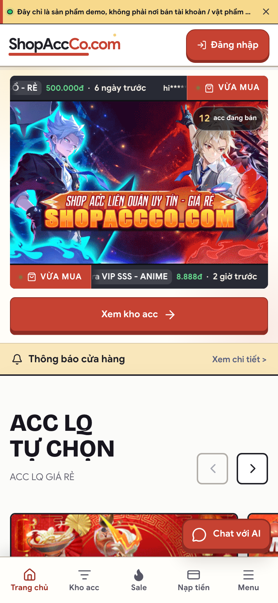
  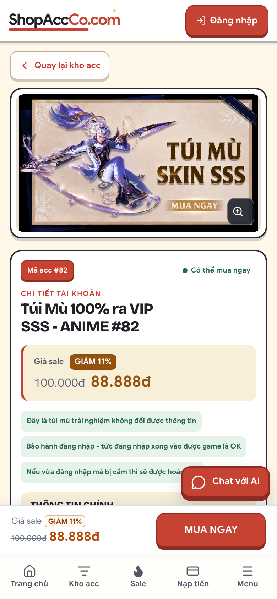
  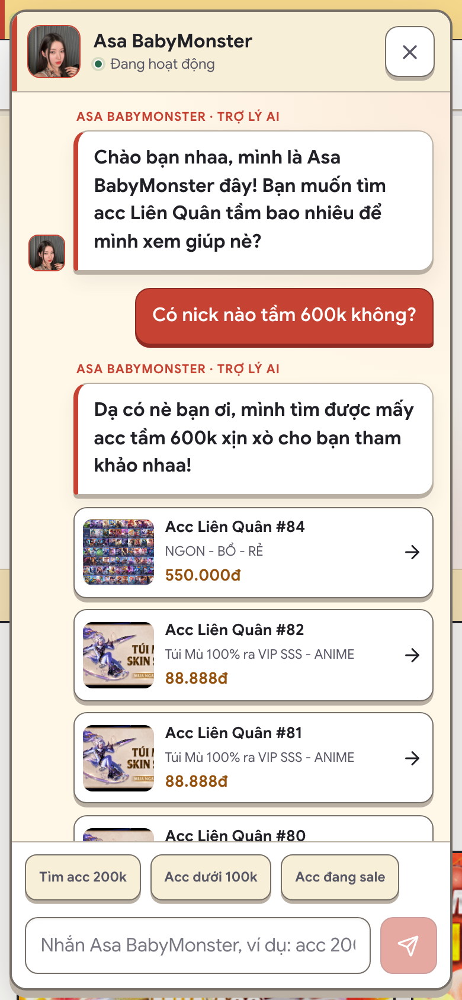

### Chat với AI Agent

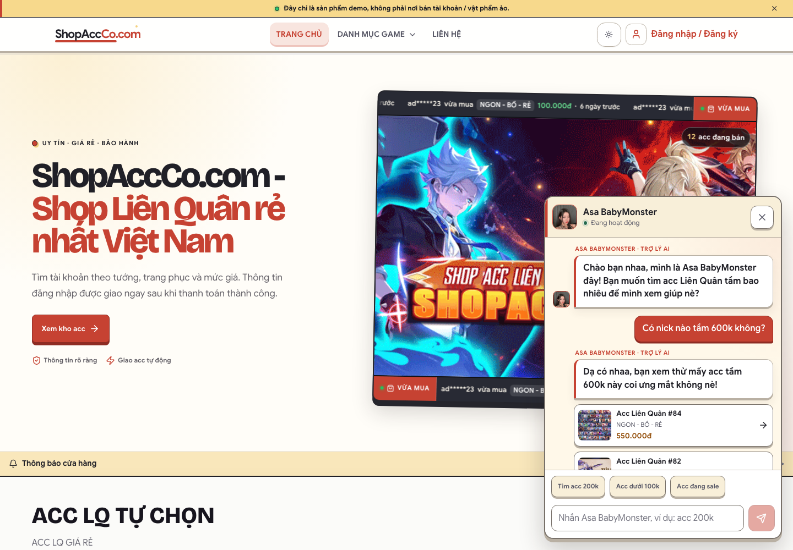

### Trang chủ

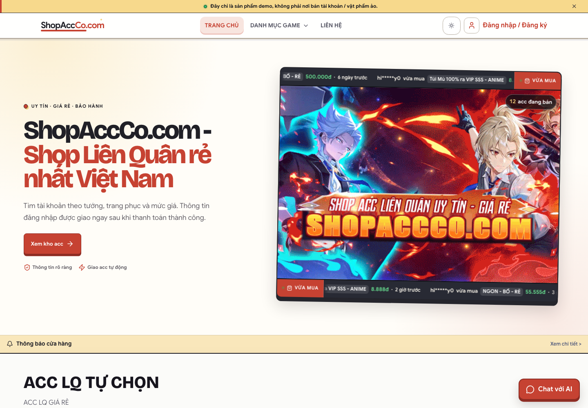

### Chọn loại tài khoản

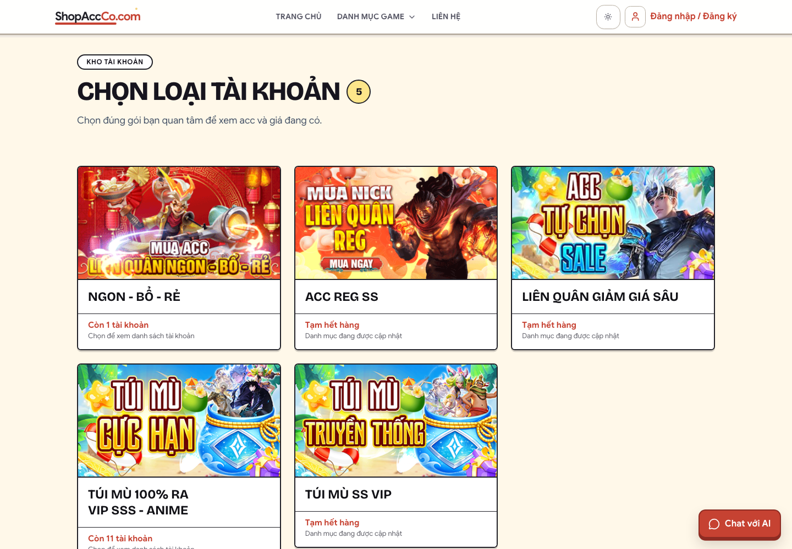

### Danh sách tài khoản

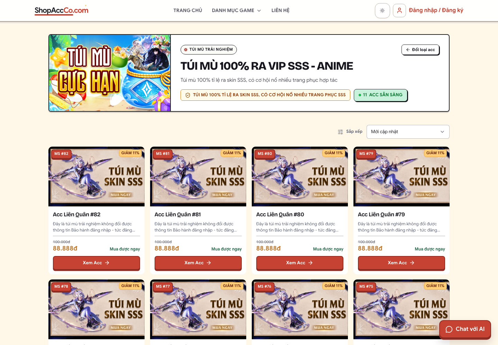

### Chi tiết tài khoản

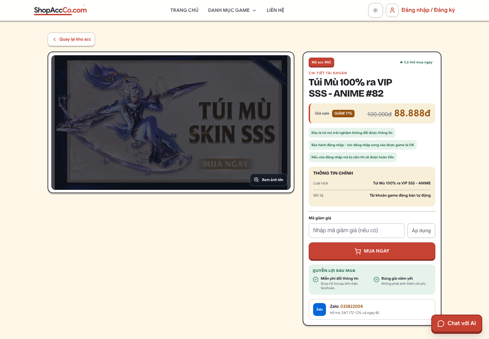

### Đăng nhập

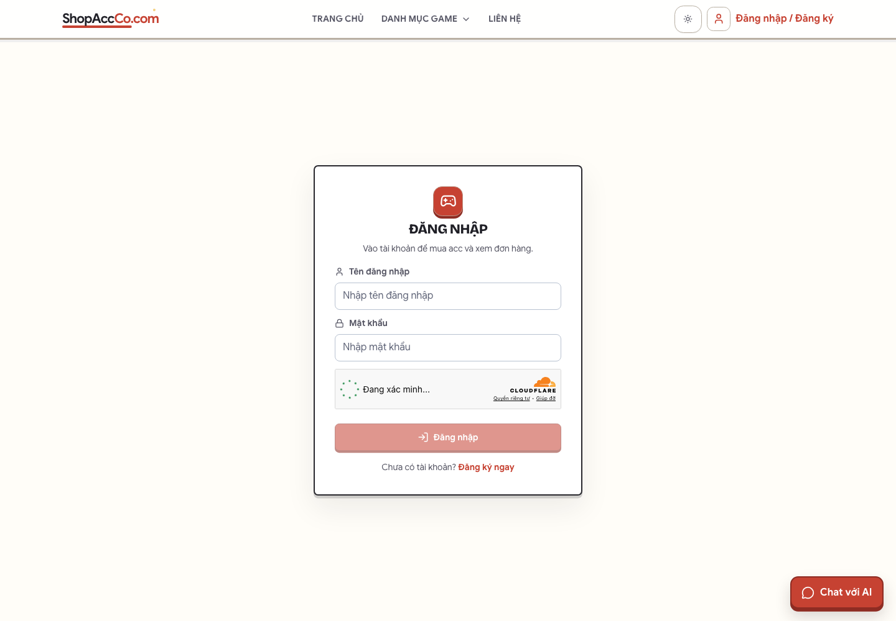

### Đăng ký

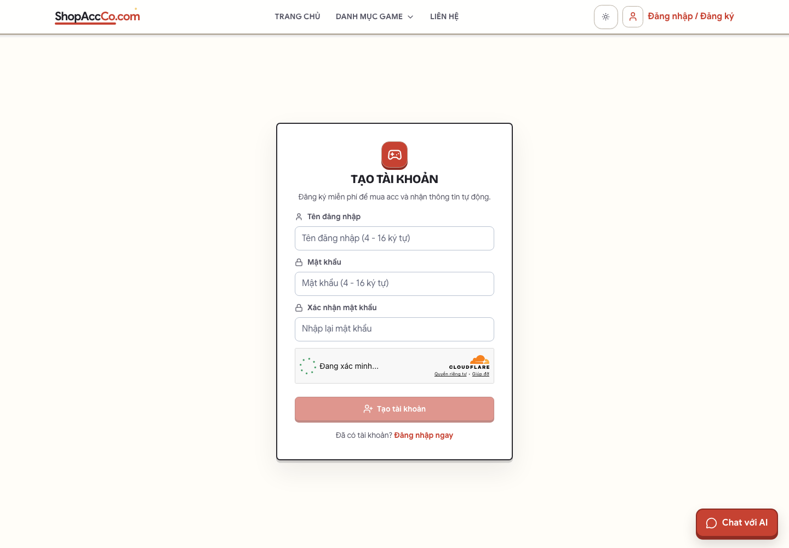

### Điều khoản và bảo hành

### Liên hệ

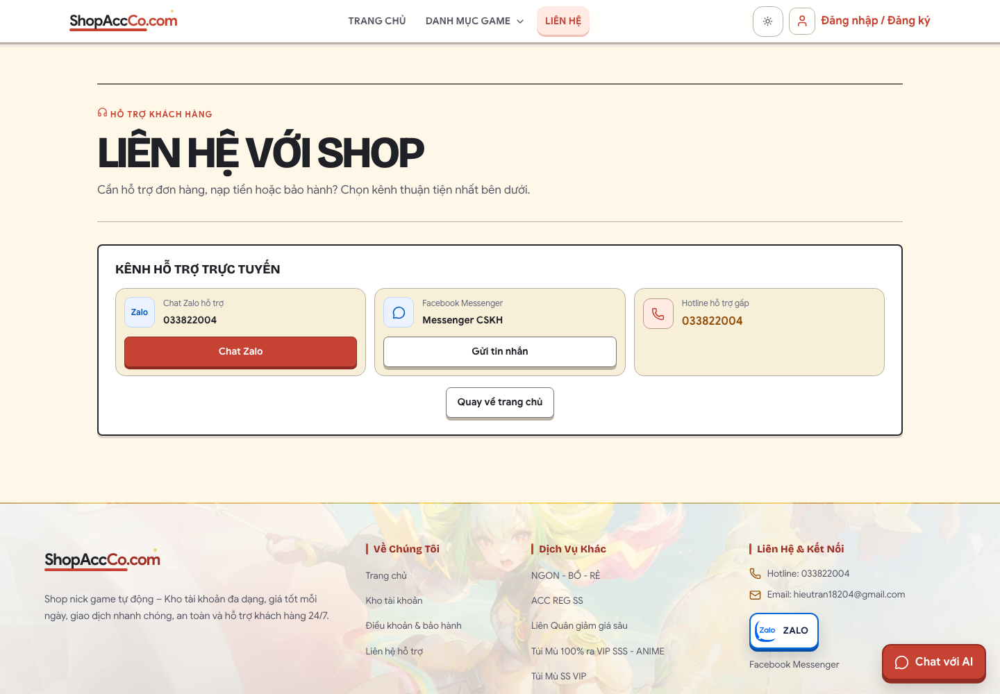

### Trang không tồn tại

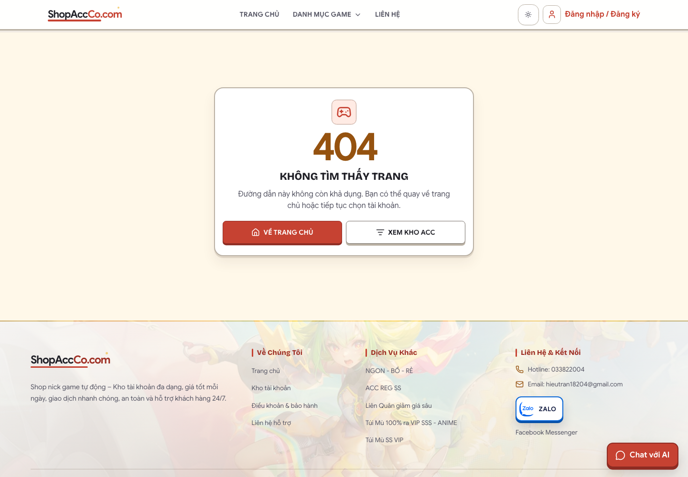

## Ghi chú

Đây là dự án cá nhân. README không chứa đường dẫn website, hướng dẫn cài đặt,
hướng dẫn sử dụng, file môi trường hoặc thông tin đăng nhập hệ thống.
